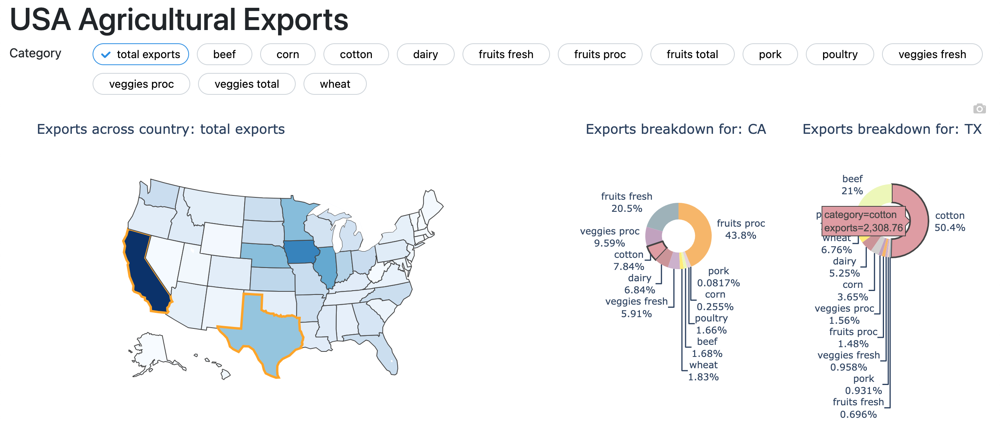

An example Dash app to explore USA agricultural exports for the year 2011.
Created as part of project assignment for Dash Online Course (Oct '23
cohort).

keywords: dash-mantine-components, choropleth, pie charts.



Instructions to run the app locally:

```
pip install -r requirements.txt
python app.py
```
